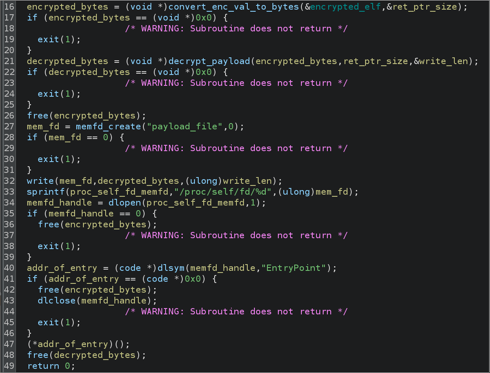
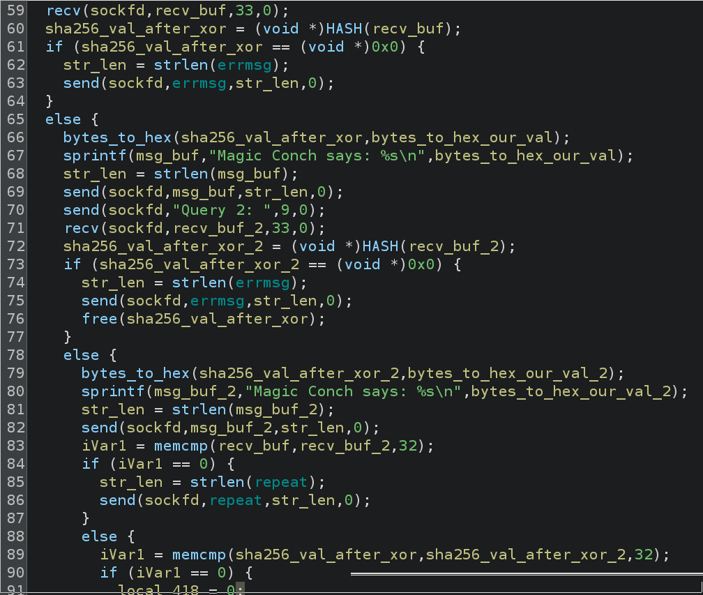
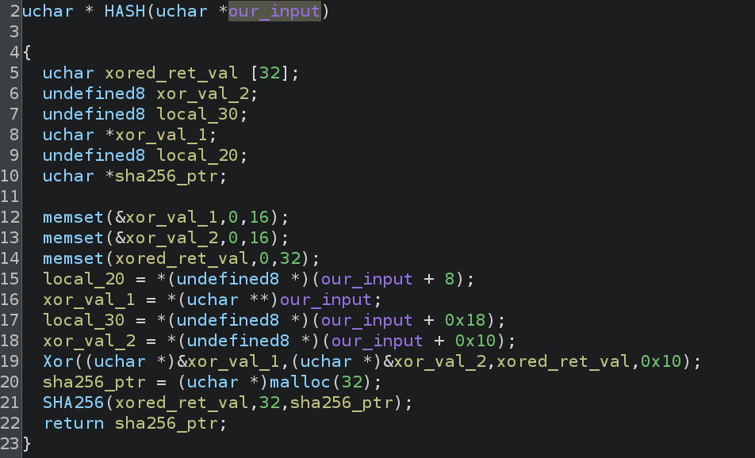

# Prompt 

Come one, come all! For a limited time only, The Magic Conch is answering your most pressing queries! Fun and knowledge will collide as you learn the deepest secrets of the unvierse! If your queries are thought-provoking enough, The Magic Conch may even present you with the flag! (Please keep your queries to 32 bytes or less; The Magic Conch does not have the patience for yappers)

Files:

    magic_conch

nc magic-conch.ctf.umasscybersec.org 1337 

# Solve 

This is an RE challenge, so we first run the program, then open the binary in Ghidra (or whatever your preferred tool is). 

Running the program shows: 

```
ERROR: Environment variable FLAG not set
```

If we pass in a FLAG variable, we see the same for a PORT variable. Once we enter that, we get a server listening at our port. Straightforward stuff.

Connecting to the listening service requests some data and returns hex-like data depending on what we enter. Our entries return the same result for the same entry, sort of like a hash. We've seen a lot of challenges like this, so it's probably a "reverse the algorithm" binary. Let's open it up and see.

## Weird Binary 

What's immediately interesting about this binary is that we can't find the strings or the commands we would expect for a challenge like this. How can this be? How can a binary listen on a port without any socket commands?

I cleaned up the binary to be fairly neat and tidy, which results in this pretty easy-to-follow code:



Let's walk through what's happening here at a high level:

1. A global data blob of ~16,000 bytes (I've marked it encrypted_elf) is grabbed and converted to raw bytes 
2. This string of bytes is then decrypted on line 21, followed by a free of the encrypted_bytes
3. We then create a memory-only file descriptor which is difficult to interface with from user space. memfds are very annoying. They can store data that never touches disk, and is therefore ephemeral
4. The decrypted bytes are written to the memory file descriptor 
5. The file descriptor is opened and the address of the symbol "EntryPoint" is loaded
6. If everything has gone well, the address of "EntryPoint" is called as a function 

So, it seems pretty straight forward: whatever code is being executed as `addr_of_entry` must be where the actual "magic" lives. But, how do we grab it? 

## Decrypting The Bytes 

I noticed in the `decrypt_payload` function that the decryption seemed straightforward. If you want to test some of your reversing chops, try to identify the initialization vector for the decryption code. One way to solve this challenge must be to actually decrypt the bytes, because the author of the challenge used fairly easy to identify "seeds" for the encryption. If you use the same library the author does to decrypt the bytes, you can just do it yourself! 

Alas, I am lazy... 

So, imagine how happy I was when it occurred to me I could just set a breakpoint at the `write` call from line 32 (whichonlyoccurredtomeafterireversedthedecryptionmechanismlollmao). If you completed the sidequest for this challenge, and you know what "YELLOW SUBMARINE" and "*CHICKEN NUGGET*" means... congrats! But, you didn't need to do that...

I set a breakpoint at just before the `write` call and I checked its parameters, which are an fd (which we don't care about), the buffer to write (which we do care about), and the amount of bytes to write. This revealed that we were going to write 168000 bytes from some memory address (because this executable is PIE, the value is different every time).

No matter where the address is, once you get it from the `write` call, you can use the handy-dandy `dump` feature of `gdb` to dump the decrypted bytes to disk:

```
gef> dump binary memory magic_conch_part_2 <start addr> <start addr + 168000>
```

We now have a new ELF (named `magic_conch_part_2` in the previous command)! However, we can't run it without segfaulting... so, let's open it in Ghidra!

## Solving The Challenge 

We see why the program segfaults... it doesn't have a `main`! But, we remember from the previous reversing that we loaded a symbol named `EntryPoint`. Sure enough, that symbol does exist; but, the function itself is super boring. It just does the socket listen stuff. 

We see that the function we *really* care about is called `thread_start`!

Sure enough, in this function we see the strings we expect, the calls we expect, etc.

Cleaning the function up, we get this: 



You notice I cut the function off at line 90, but that's only because the remaining code doesn't matter. All you need to know is that if the comparison on line 89 is of two equal values, then we pass the check on line 90 and the flag is printed for us. The actual algorithm is what is pictured here. 

Reading Ghidra can be a daunting task, but if you follow along closely enough, you can effectively see that we have a `recv` call that gets our first "query" for the `magic_conch`. Our entered value is run through a custom function named `HASH` which does some calculations on the input and then returns the `sha256` checksum of the calculated input.

This process is repeated again for a second `recv` call so long as no errors occur. Then things get interesting... 

On line 83, our `recv` buffers are compared and if they are the same, the program exits. This means we can't enter the same value twice. Why that is interesting is because the comparison on line 89 is for the calculated values of our input. This means that we must enter two *different* values that, when caluclated by the `HASH` function return the same result. 

Let's look at `HASH`:



This function is very simple. I have no clue what the decompilation is trying to tell us on lines 15 and 17, but lines 16 and 18 tell me that we are splitting our 32 byte input (the `recv` calls were only for 32 bytes -- well, 33, but the newline is removed) into two, separate 16 byte values which are XOR-ed together. Those XOR-ed values are then `sha256` checksummed. 

*Voila!* We need the first 16 bytes to be the second 16 bytes in our second call, and the second 16 bytes to be the first 16 bytes in our second call! 

...

That's confusing, so let's show an easy example.

This could look like this: 

`AAAAAAAAAAAAAAAABBBBBBBBBBBBBBBB`

and 

`BBBBBBBBBBBBBBBBAAAAAAAAAAAAAAAA`

There are like... millions of possible ways to do this. So long as the values don't match but we use the same set of 16 bytes twice, we can get the flag!

UMASS{dYN4M1C_an4ly$1s_4_Th3_w1n}
