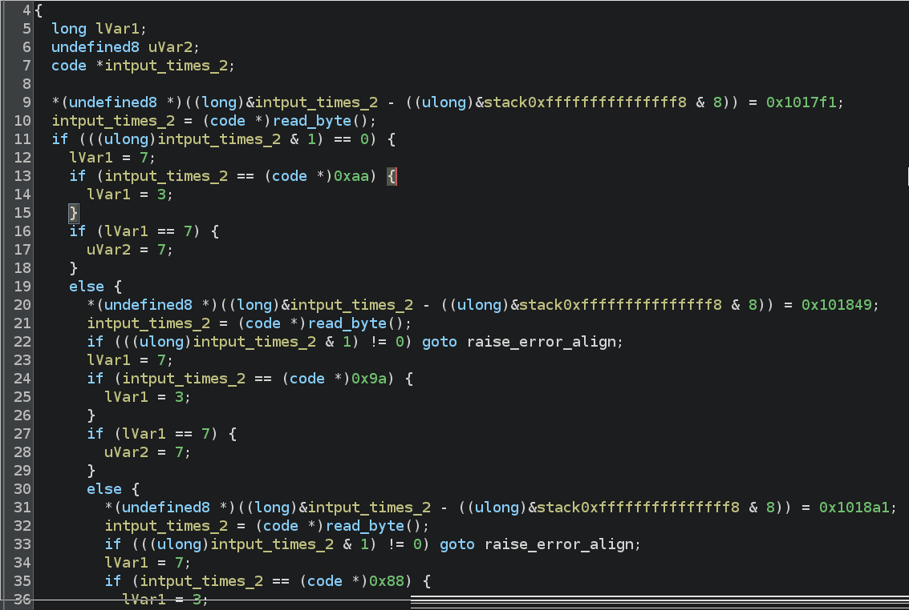

# Prompt 

This binary was compiled by an hand-crafted, artisan racket compiler, courtesy of UMD's very own CMSC430 class.

# Solve 

This challenge was very easy, so I solved it by hand.

I am not sure how this compiler works, but we have symbols and the function `entry` contains all of our logic.

We see some checks for even/odd, but what really matters is that there is a function named `read_byte` which takes our input one byte at a time and multiplies it by 2.

The `entry` function contains many checks for these bytes, which tells us our flag is just these values divided by two. The `entry` function looks like this:



Lines 13, 24, and 35 show the checks I am referring to. I excluded many of them as the function was very long. 

All that matters is that our checks are for the following:

```
chrs = [ 0xaa, 0x9a, 0x88, 0x86, 0xa8, 0x8c, 0xf6, 0xe6, 0xd0, 0xde, 0xea, 0xe8, 0xbe, 0xde, 0xea, 0xe8, 0xbe, 0xe8, 0xde, 0xbe, 0xd4, 0xde, 0xe6, 0xca, 0xfa ]
```

With this information, we can easily solve the challenge as such:

```
for c in chrs:
  print(f"{chr(c // 2)}", end"")

UMDCTF{shout_out_to_jose}
```
