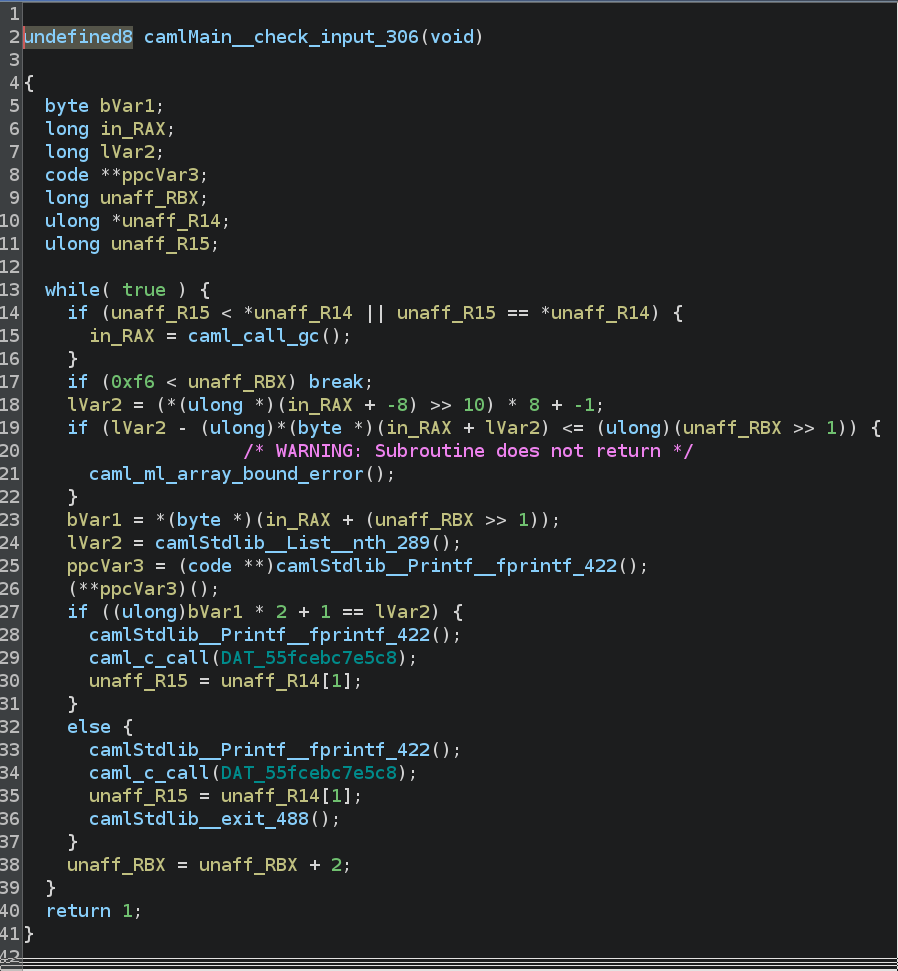
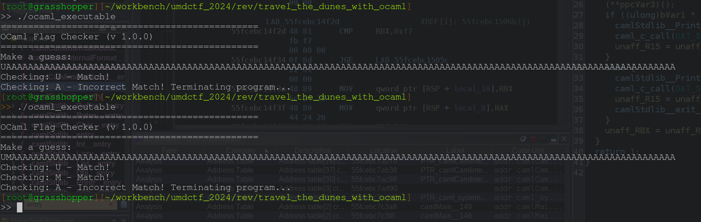
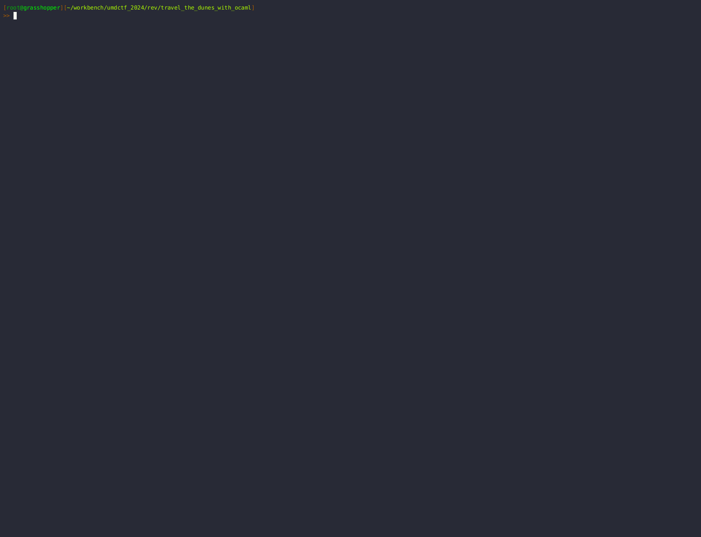

# Prompt 

ocaml_executable is a flag checker compiled and assembled from OCaml using ocamlopt. Can you rev it?

Hint: The flag is 123 characters in length.

# Solve 

ocaml binaries are infamously obnoxious. I don't know enough about the architecture of ocaml or its compilers to know why this is the case, but every ocaml binary I have seen seems to have functionality baked in that is (seemingly) completely dead code *and/or* much of the logic is deeply wrapped inside of ocaml standard functions. 

Just a simple example from this binary: If we run the binary and enter some input, we see an `Incorrect Length!` error. Finding the code path for this print statement was obnoxious, but eventually, you can find the check, as seen below (I won't describe it, so you can see how non-obvious these binaries can be):

## Our Favorite Strategy 

I don't keep secret that I love solving rev challenges by not actually reversing them. Everytime it seems possible, I take that approach first. 

For some reason, the ctf organizers give us the insanely valuable hint that the flag is 123 characters long, which means we didn't even have to reverse the length function shown previously (as a side note, I am fairly certain this hint was placed in the challenge later, as I went about reversing the length check before noticing it -- could have been an operator error, though).

This hint is helpful, because once we have the length down, we immediately start noticing that the code reports whenever you have matched a character from the flag and only exits when it hits a "bad" flag character.

That's a little confusing to read, so let me show you:

Why does this matter?

Because if the flag's alphabet is only in the keyspace of printable characters (which we know it is), *and* we know when we hit the next correct character, **we can brute force the flag**! This works because *normally* if you have a 123 byte flag, you would have to brute force it by starting at `aa...a`, `aa...b`, `aa...c`, etc.

The sun would burn out before we found the correct combination of characters, and this writeup would be fairly late. 

However, if we know exactly when we hit a correct character, then our brute force only has to run *at most* `alphabet_chars * flag_len` times or `94 * 123` or 11,562 times, which is *easily* brute-forcable. As a side not, the `94` from the equation comes from the alphabet we used, which was created from the `string` python library. We used the `ascii_letters`, `digits`, and `punctuation` imports specifically, since the `ascii_printable` import included whitespace characters such as `\t`, which we don't care about.

Anything below 100,000 executions is a simple bruteforce (so long as we can run the brute force locally and not over a network). I don't know what the upper-limit for *reasonable* brute-force is, but when I relaized this challenge would take fewer than 12,000 iterations, I knew I could stop reversing the binary and just brute force it.

## The Force Is String With This One

I wrote a script that counts the number of times `- Match!` is printed when we run the binary. I won't go through all of the script logic as I have included it here and it is very straightforward. I wanted to point this one piece of logic out, however, because I couldn't think of a better way to count "correct" characters. This is dirty, but it works. We couldn't just count `Match`, because if we get a character wrong, we get a message that says `Incorrect Match`.

The solution is available for your review, but here's an `asciinema` clip of it working. I print the flag every time I find a correct character and pad the flag's "unknown" characters with "A"s.

If you run the solver yourself, you will notice that several "junk" files are left in the directory from which you ran the solver. Can you find the bug in my code?
